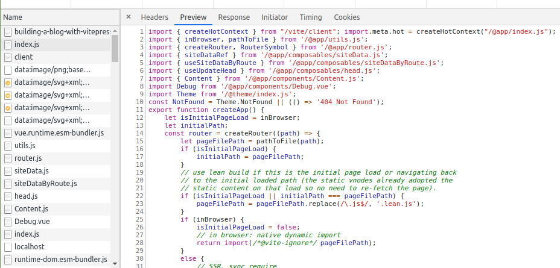

# Vue Bleeding Edge: Vite & VitePress

<div class="text-xs text-gray-600"><time>24th Nov 2020</time></div>

In rebuilding my personal blog, I wanted to challenge myself to learn the latest tech, the unknown.

The unknown was Evan You's latest contribution, a new **⚡ fast ⚡** build tool called Fast, for the Frenchies, [Vite](https://github.com/vitejs/vite) for the rest of us.
As well as the new Vue/Vite framework: [VitePress](https://github.com/vuejs/vitepress). Neither of them are stable 🐛


In this post you'll learn about what Vite and why it could be the next best thing in developer experience. I'll also share my thoughts on
VitePress.


## A recap on Vite

Vite is a framework agnostic, web dev build tool, like [webpack](https://github.com/webpack/webpack), that exists to make your life better. 
Better in this case means:
- ⌛ Less time waiting for webpack builds to start your app
- 🔥 Hot module reloading that is instant
- 🔨 On-demand compilation of your code
- 🙅‍♂️ Zero configuration to mess with for all major pre-processing (typescript, scss, pug, etc)

The big change is how your code is served. 

- Webpack bundles [ES Modules](https://www.2ality.com/2014/09/es6-modules-final.html), [CommonJS](http://wiki.commonjs.org/) and [AMD Modules](https://github.com/amdjs/amdjs-api/wiki/AMD) in development and production.

- Vite serves native ES Modules without bundling in development and with ES Modules [Rollup](https://github.com/rollup/rollup) for production. 

The easiest way to think of modules for now, is one of as files, like a .vue or .scss file.

::: tip TIP
Check out Mozilla's <a href="https://hacks.mozilla.org/2018/03/es-modules-a-cartoon-deep-dive/" target="_blank">article</a> on ES Modules if you need a refresher.
:::

### Understanding Webpack Bundling

Webpack is a black box of magic, even with most modern frameworks using it, understanding the intricacies is a challenge.

Webpack's core function is to combine and compile your code and dependencies into larger and more complex bundles. 
Speeding up your apps performance wth code splitting, tree shaking and other optimisations.

Pre-bundling and compiling are great. However, to bundle and compile your code, webpack needs to go through _all_ of your code. When your application grows
so does your webpack build time.

Bundling in development is quicker because you usually don't need to compile as much of your code, however it can
still become painfully slow, specially on older machines. 

Anecdotally, I've seen this in a Vue2 Nuxt.js project I worked on over a 2-year period.

| App  | Production Build Time        | Server Start Time  | HMR Time  |
| ------------- |-------------:| -----:| -----:|
| 2 years ago     | ~2 min | ~10 seconds | ~2 seconds | 
| Today     | ~15 min ⚠️ | ~3 min ⚠️ | ~10 seconds |

The easiest way for me to understand bundling and how it works in my app is to visualise it. We can do this by inspecting
the HTML source of our page and the sweet [webpack-bundle-analyzer](https://www.npmjs.com/package/webpack-bundle-analyzer) tool.

**My previous Nuxt.js blog**

```html
<script src="/_nuxt/commons.app.js" defer></script>
<script src="/_nuxt/vendors.app.js" defer></script>
<script src="/_nuxt/app.js" defer>
```


### No-Bundling in Action (via Native ES Modules)

When you start Vite, and visit your site, your site will request from the Vite server all of your sites code files as separate requests, waterfall style. 

Behind the scenes Vite is running [Koa](https://github.com/koajs/koa), a light-weight node web server. The server will handle
requests for your code files, checking if the client needs a fresh copy, if so will response with your code - compiled if required.

This allows Vite to start without compiling or bundling anything and means you only compile things as you need them.

Your code is requested as Native ES Modules, meaning they can be optimised at a browser level for the code you really need.

Hot module reloading (HMR) works in a similar way where the server will push to the client any updates modules. 

The easiest way to understand what is happening is to check what is happening at the DOM and network level.

**VitePress HTML**

```html
<script type="module">import "/vite/client"</script>
<div id="app"></div>
<script type="module" src="/@app/index.js"></script>
```





### So how quick we talking?

The instant HMR time and the other speed improvements are just so satisying and will scale with your project.

| App  | Production Build Time        | Server Start Time  | HMR Time  |
| ------------- |-------------:| -----:| -----:|
| Today     | ~15 sec | <= 1 second | instant |

## VuePress's baby brother: VitePress

::: warning WARNING
VitePress is an early WIP! It's not recommended to use for anything serious yet.
:::

Little did I know when I chose to use VitePress, but it exists for the primary function of documentation sites. 
That's not to say you can't build other type of sites with it, just a lot of the feature and design decisions have been
made around that use case. 

Given that fact, I still had a lot of fun playing with VitePress and getting it to work for my blog.

### The good 

What I really enjoy comes down to the speed and the simplicity of everything.

- 🙅‍♂️ Zero configuration out of the box. Your project could be an index.md and a package.json
- 🔥 Hot module reloading for markdown content makes writing a breeze
- 🔨 Basic support to change the default theme through a simple config.js file


If you're looking to use it for a serious project or a blog, I'm not sure I'd recommend it, unless your intent on maintaining it.

### The 'needs' some work

- Documentation is not complete (Vuepress docs mostly work)
- HMR does not work on theme files?
- Asset paths can trip you up
- Requiring MD files for pages feels a bit limiting
- No way to query all pages
- @vuepress/plugin-blog does not seem to work

### Summary

## Building your own VitePress Blog 