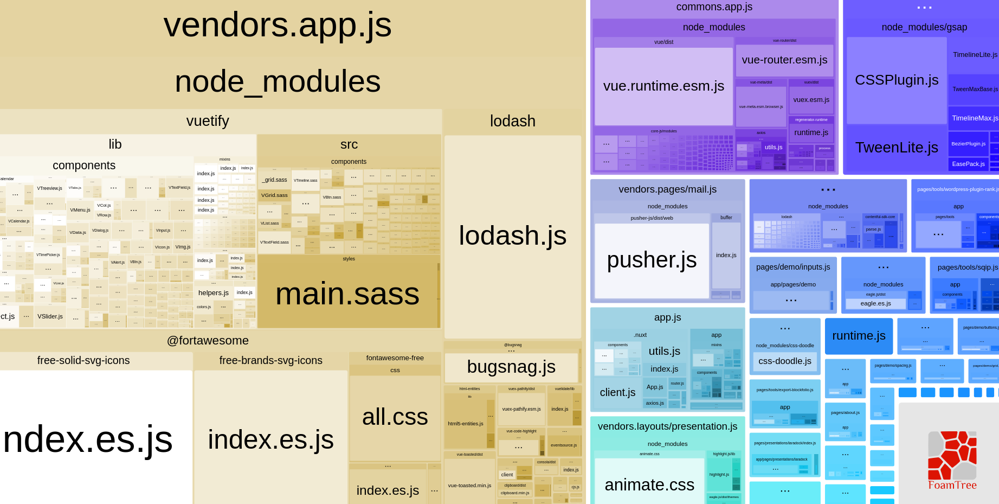
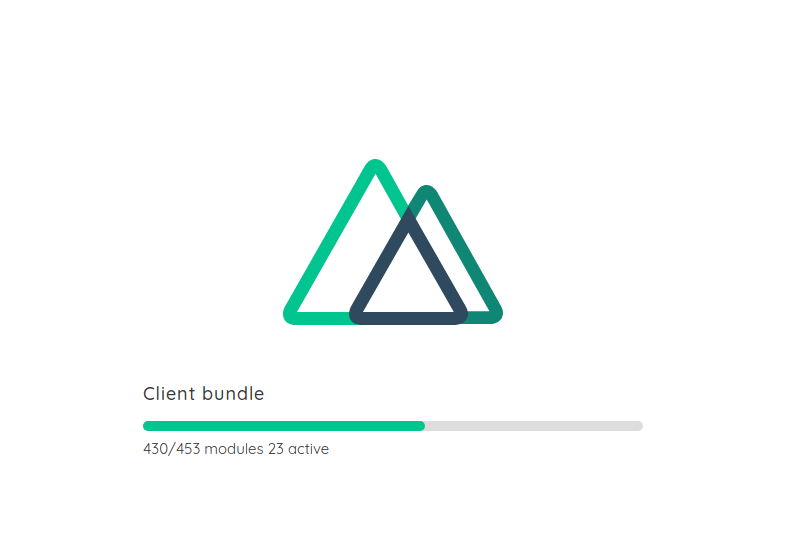
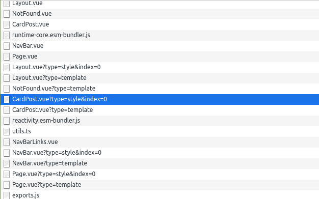

# How Vite Upgrades The Vue Developer Experience

<div class="text-xs text-gray-600"><time>30th Nov 2020</time></div>

In rebuilding my personal blog, I wanted to challenge myself to learn the latest tech, the unknown.

The unknown was the new project by Evan You: [⚡ Vite](https://github.com/vitejs/vite) (/veet/). Called Fast, for the 🇫🇷 Frenchies.

In this post I'm going to assume you're using a webpack + webpack-dev-server stack, it's used by all major Vue frameworks: Nuxt.js, Vue-CLI, VuePress, etc. You'll learn a little about how webpack works, how Vite works and comparing the two.

Vite could the next best thing in tooling, currently, it's still in a pre-release stage though so be careful out there 🐛.

**Table of contents**

[[toc]]

## A Recap on Vite

Vite is a framework-agnostic web dev build tool. It's an experimental new direction in how build tools can work with a greenfield ecosystem. 

Vite's core functionality is similar to [webpack](https://github.com/webpack/webpack) + [webpack-dev-server](https://github.com/webpack/webpack-dev-server) with some core improvements
on developer experience:
 
- ⌛ Less time waiting for your app to start, regardless of app size
- 🔥 Hot module reloading (HMR) that is basically instant, regardless of app size
- 🔨 On-demand compilation
- 🙅‍♂️ Zero configuration for numerous pre-processors out of the box
- 📜 Esbuild powered typescript / jsx (super quick)

## Comparing Vite to your Webpack app

The core difference you'll notice with Vite is how code is served in development and which modules are supported. 

Webpack apps (Nuxt.js / Vue-CLI / etc): 
- Modules: [ES Modules](https://www.2ality.com/2014/09/es6-modules-final.html), [CommonJS](http://wiki.commonjs.org/) and [AMD Modules](https://github.com/amdjs/amdjs-api/wiki/AMD) 
- Dev Server: Bundled modules served via [webpack-dev-server](https://github.com/webpack/webpack-dev-server) using express.js web server
- Production Build: Webpack Bundled modules 

Vite apps:
- Modules: [ES Modules](https://www.2ality.com/2014/09/es6-modules-final.html)
- Dev Server: Native-ES-Modules, served via Vite using a koa web server
- Production build: [Rollup](https://github.com/rollup/rollup) bundled modules

Don't worry if the above comparison doesn't make sense to you, we'll be exploring these concepts.
    
::: tip TIP
Check out Mozilla's <a href="https://hacks.mozilla.org/2018/03/es-modules-a-cartoon-deep-dive/" target="_blank">article</a> on ES Modules.
:::

### Understanding Webpack apps

To understand how Vite works, it's easiest to look at how Webpack works first. Even with its popularly, understanding it can be intimidating, so I'll try to keep it simple.

Webpack's core function is to bundle your code with the following steps:
- Starting with an entry file, build a graph of your dependency tree: all the imports, exports from your code/files (modules)
- Orchestrate the transforming of modules: think transpiling js for older browsers, turning SCSS into CSS
- Use algorithms to sort, rewrite and concatenate

#### What bundles look like

I'm very much a visual learner, so using the [webpack-bundle-analyzer](https://www.npmjs.com/package/webpack-bundle-analyzer), checking the HTML source and network tab helps.

```html
<script src="/_nuxt/commons.app.js" defer></script>
<script src="/_nuxt/vendors.app.js" defer></script>
<script src="/_nuxt/app.js" defer>
```

<figure>
  
  <figcaption>Nuxt.js bundles</figcaption>
</figure>

#### Webpack for Development

Assuming we're using one of those main Vue frameworks when you start your app in development, it is going to do a couple of things:
1. Bundle all of your code with the above steps
2. Start the webpack-dev-server which will serve your bundles and handle Hot module reloading

As you may notice with your own apps, the bigger they grow, the longer you have to wait to start coding.

<figure>
  
  <figcaption>The Nuxt logo is almost burnt into my monitor at this point.</figcaption>
</figure>

Bundling in development is quicker because you don't need to do as much with the code, however, it can
still become painfully slow, especially on older machines. 

Anecdotally, I've seen this in a Nuxt.js project I worked on over 2 years. It grew from a next to instant server start to now
3-minutes. If we assume I restart the server on average 5 times a day, for a year I'd be waiting at least 60 hours to start coding.

#### Webpack for Production Builds

When you build your app for production, you are bundling with extra performance optimisations and not running a server. Unless you are building
as a universal app (pre-rendering page), in which case the server will be running as the app builds.

Production builds, as you would expect, slow down the bigger your application gets.

### Understanding Vite

Vite, at its core, doesn't set out to be a new code bundler like webpack or Rollup. Rather, a specific tool built for the developer experience.

Vite makes the assumption that developers are going to be using the latest browser versions, so it can safely rely on the
 latest JS functionality straight from the browser - in other words, no babel transpiling!

#### Vite Start

When you start Vite for the first time pre-optimisations will be done on your dependencies, then [Koa](https://github.com/koajs/koa), a light-weight node web server starts. 
There is no bundling or compiling needed to start the dev server.

When you open your Vite app, the browser is going look at your entry file as a native es module, meaning it will read the `export` and `import` statements from your code.
It will transfer those lines into HTTP requests back to the server, where it will keep going through that waterfall process until all of your modules have been resolved.

```html
<script type="module">import "/vite/client"</script>
<div id="app"></div>
<script type="module" src="/@app/index.js"></script>
```

<figure>
  
  <figcaption>Network requests triggered from the entry.</figcaption>
</figure>

#### Waterfall Request Example

Let's take a look at how these requests are working in the browser. Vite has sent me the following index.js file:

```js{5}
import '/@theme/styles/main.scss?import';
import Layout from '/@theme/Layout.vue';
import NotFound from '/@theme/NotFound.vue';
import CardPost from '/@theme/components/CardPost.vue';

const theme = {
    Layout,
    NotFound,
    enhanceApp({ app, }) {
        app.component('CardPost', CardPost)
    }
};
export default theme;
```

Normally, in webpack, you would have to transpile this code to something legacy browsers can understand. But new browsers know 
what to do with this. 

Let's drill into that highlighted line which is requesting the CardPost SFC.

This triggers a request in the browser to the path `http://localhost:3000/@theme/components/CardPost.vue`.
 
At this point, the webserver will need to compile the Vue component to javascript and send it back to me. Let's look at what comes through:

```js{22-23}
import posts from '/.vitepress/posts.ts'

const __script = {
    props: {
        postIndex: {
            type: Number,
            required: true,
        }
    },
    computed: {
        post() {
            return posts[this.postIndex]
        }
    }
}

import "/@theme/components/CardPost.vue?type=style&index=0"
__script.__scopeId = "data-v-287b4794"
import {render as __render} from "/@theme/components/CardPost.vue?type=template"
__script.render = __render
__script.__hmrId = "/@theme/components/CardPost.vue"
typeof __VUE_HMR_RUNTIME__ !== 'undefined' && __VUE_HMR_RUNTIME__.createRecord(__script.__hmrId, __script)
__script.__file = "/home/harlan/sites/new.harlanzw.com/app/.vitepress/theme/components/CardPost.vue"
export default __script
//# sourceMappingURL=data:application/json;base64,eyJ2ZXJzaW9uIjozLCJzb3VyY2VzIjpbIi9ob21lL2hhcmxhbi9zaXRlcy9uZXcuaGFybGFuencuY29tL2FwcC8udml0ZXByZXNzL3RoZW1lL2NvbXBvbmVudHMvQ2FyZFBvc3QudnVlIl0sIm5hbWVzIjpbXSwibWFwcGluZ3MiOiI7QUFpQkEsQ0FBQyxDQUFDLENBQUMsQ0FBQyxDQUFDLEVBQUUsQ0FBQyxDQUFDLENBQUMsQ0FBQyxFQUFFLENBQUMsQ0FBQyxDQUFDLEVBQUUsQ0FBQyxDQUFDLENBQUMsQ0FBQyxDQUFDLENBQUMsQ0FBQyxDQUFDLENBQUMsQ0FBQyxDQUFDLENBQUM7O0FBRTlCLENBQUMsQ0FBQyxDQUFDLENBQUMsQ0FBQyxFQUFFLENBQUMsQ0FBQyxDQUFDLENBQUMsQ0FBQyxDQUFDLEVBQUU7RUFDYixDQUFDLENBQUMsQ0FBQyxDQUFDLENBQUMsRUFBRTtJQUNMLENBQUMsQ0FBQyxDQUFDLENBQUMsQ0FBQyxDQUFDLENBQUMsQ0FBQyxDQUFDLEVBQUU7TUFDVCxDQUFDLENBQUMsQ0FBQyxDQUFDLEVBQUUsQ0FBQyxDQUFDLENBQUMsQ0FBQyxDQUFDLENBQUM7TUFDWixDQUFDLENBQUMsQ0FBQyxDQUFDLENBQUMsQ0FBQyxDQUFDLENBQUMsRUFBRSxDQUFDLENBQUMsQ0FBQyxDQUFDO0lBQ2hCO0VBQ0YsQ0FBQztFQUNELENBQUMsQ0FBQyxDQUFDLENBQUMsQ0FBQyxDQUFDLENBQUMsQ0FBQyxFQUFFO0lBQ1IsQ0FBQyxDQUFDLENBQUMsRUFBRSxDQUFDLEVBQUU7TUFDTixDQUFDLENBQUMsQ0FBQyxDQUFDLENBQUMsRUFBRSxDQUFDLENBQUMsQ0FBQyxDQUFDLENBQUMsQ0FBQyxDQUFDLENBQUMsQ0FBQyxDQUFDLENBQUMsQ0FBQyxDQUFDLENBQUMsQ0FBQyxDQUFDLENBQUMsQ0FBQyxDQUFDLENBQUM7SUFDN0I7RUFDRjtBQUNGIiwiZmlsZSI6Ii9ob21lL2hhcmxhbi9zaXRlcy9uZXcuaGFybGFuencuY29tL2FwcC8udml0ZXByZXNzL3RoZW1lL2NvbXBvbmVudHMvQ2FyZFBvc3QudnVlIiwic291cmNlUm9vdCI6IiIsInNvdXJjZXNDb250ZW50IjpbIjx0ZW1wbGF0ZT5cbjxkaXYgY2xhc3M9XCJjYXJkLXBvc3QgLW14LTggbXktOCBob3ZlcjpzaGFkb3ctbGcgdHJhbnNpdGlvbi1hbGxcIj5cbiAgPGRpdiBjbGFzcz1cImNhcmQtcG9zdF9fZWZmZWN0XCI+PC9kaXY+XG4gIDxhIGNsYXNzPVwiY2FyZC1wb3N0X19saW5rIHVuc3R5bGVkXCIgOmhyZWY9XCJwb3N0LnVybFwiPjwvYT5cbiAgPGRpdiBjbGFzcz1cImNhcmQtcG9zdF9fY29udGVudFwiPlxuICAgICAgPGRpdiBjbGFzcz1cInAtOCBwcm9zZSBwcm9zZS14bFwiPlxuICAgICAgICA8aDMgc3R5bGU9XCJtYXJnaW4tdG9wOiAwICFpbXBvcnRhbnQ7XCI+PGEgOmhyZWY9XCJwb3N0LnVybFwiIGNsYXNzPVwidGV4dC0yeGxcIiBzdHlsZT1cImZvbnQtd2VpZ2h0OiBib2xkO1wiPnt7IHBvc3QudGl0bGUgfX08L2E+PC9oMz5cblxuICAgICAgICA8ZGl2IGNsYXNzPVwidGV4dC14cyB0ZXh0LWdyYXktNjAwXCI+PHRpbWU+e3sgcG9zdC5wdWJsaXNoZWQgfX08L3RpbWU+PC9kaXY+XG5cbiAgICAgICAgPHAgY2xhc3M9XCJ0ZXh0LW1kIHRleHQtZ3JheS02MDBcIj57eyBwb3N0LmV4Y2VycHQgfX08L3A+XG4gICAgICA8L2Rpdj5cbiAgPC9kaXY+XG48L2Rpdj5cbjwvdGVtcGxhdGU+XG5cbjxzY3JpcHQ+XG5pbXBvcnQgcG9zdHMgZnJvbSAnLi4vLi4vcG9zdHMnXG5cbmV4cG9ydCBkZWZhdWx0IHtcbiAgcHJvcHM6IHtcbiAgICBwb3N0SW5kZXg6IHtcbiAgICAgIHR5cGU6IE51bWJlcixcbiAgICAgIHJlcXVpcmVkOiB0cnVlLFxuICAgIH1cbiAgfSxcbiAgY29tcHV0ZWQ6IHtcbiAgICBwb3N0ICgpIHtcbiAgICAgIHJldHVybiBwb3N0c1t0aGlzLnBvc3RJbmRleF1cbiAgICB9XG4gIH1cbn1cbjwvc2NyaXB0PlxuXG48c3R5bGUgbGFuZz1cInNjc3NcIiBzY29wZWQ+XG4uY2FyZC1wb3N0IHtcblxuICBwb3NpdGlvbjogcmVsYXRpdmU7XG5cbiAgLnByb3NlIHtcbiAgICBtYXgtd2lkdGg6IDEwMCUgIWltcG9ydGFudDtcbiAgfVxuXG4gICZfX2xpbmsge1xuICAgIHBvc2l0aW9uOiBhYnNvbHV0ZTtcbiAgICBsZWZ0OiAwO1xuICAgIHRvcDogMDtcbiAgICB3aWR0aDogMTAwJTtcbiAgICBoZWlnaHQ6IDEwMCU7XG4gICAgY29udGVudDogJyAnO1xuICAgIHotaW5kZXg6IDE7XG4gIH1cblxuICAmX19jb250ZW50IHtcbiAgICBiYWNrZ3JvdW5kLWNvbG9yOiB3aGl0ZTtcbiAgICB6LWluZGV4OiAxO1xuICB9XG5cbiAgJl9fZWZmZWN0IHtcbiAgICB6LWluZGV4OiAtMTtcbiAgICBjb250ZW50OiAnICc7XG4gICAgaGVpZ2h0OiAzMHB4O1xuICAgIHdpZHRoOiAxMDAlO1xuICAgIHBvc2l0aW9uOiBhYnNvbHV0ZTtcbiAgICBiYWNrZ3JvdW5kLWNvbG9yOiByZ2IoNSwgMTUwLCAxMDUpO1xuICAgIHRyYW5zaXRpb246IDAuMnM7XG4gICAgb3BhY2l0eTogMDtcbiAgICB0b3A6IDMwcHg7XG4gIH1cblxuICAmOmhvdmVyIHtcbiAgICAuY2FyZC1wb3N0X19lZmZlY3Qge1xuICAgICAgdG9wOiAtNXB4O1xuICAgICAgb3BhY2l0eTogMTtcbiAgICAgIHRyYW5zZm9ybTogcm90YXRlKDAuMjVkZWcpO1xuICAgIH1cbiAgfVxufVxuPC9zdHlsZT5cbiJdfQ==
```

Cool, so quite a bit going on here. Interestingly it's serving the template and styles from my component
in separate requests.

```js
import {updateStyle} from "/vite/client"
const css = ".card-post[data-v-287b4794] {\n  position: relative;\n}\n.card-post .prose[data-v-287b4794] {\n  max-width: 100% !important;\n}\n.card-post__link[data-v-287b4794] {\n  position: absolute;\n  left: 0;\n  top: 0;\n  width: 100%;\n  height: 100%;\n  content: \" \";\n  z-index: 1;\n}\n.card-post__content[data-v-287b4794] {\n  background-color: white;\n  z-index: 1;\n}\n.card-post__effect[data-v-287b4794] {\n  z-index: -1;\n  content: \" \";\n  height: 30px;\n  width: 100%;\n  position: absolute;\n  background-color: #059669;\n  transition: 0.2s;\n  opacity: 0;\n  top: 30px;\n}\n.card-post:hover .card-post__effect[data-v-287b4794] {\n  top: -5px;\n  opacity: 1;\n  transform: rotate(0.25deg);\n}"
updateStyle("287b4794-0", css)
export default css
```

So just one small component we can see that it's making 3 HTTP requests, you can guess that this stacks up pretty quickly. 
Vite optimises these waterfall requests using 304 Unmodified HTTP responses for modules which haven't changed, keeping things fast. It also
only loads files that are needed to show that route.

#### Vite Hot Module Reloading (HMR)

The HMR is pretty complex and I haven't got my head around it completely yet. All you need to know is that it works out of the box
for most files and it's fast.


## How fast is fast?

New Vue 3 project / 10 components / no Babel / 2nd run, in development.

| Tool  | Build Time        | Dev Server Start Time  | Page Load Time  |
| ------------- |-------------:| -----:| -----:|
| Vue CLI     | 5.14s | 2568ms | 320ms | 
| Vite     | 2.39s | 232ms️ | ~10 seconds |

The page load time is slower because of the overhead of HTTP request but there is still a significant improvement. The real
speed improvements you'll see on larger projects.

## Getting started with Vite

I'd recommend just spinning up bare-bones Vite to get a feel for it. It's really easy, takes less than a minute.

```shell script
npm init vite-app
```

Once you're familiar with it and are sold, it's worth checking out [the ecosystem](https://github.com/vitejs/awesome-vite)   

### Recommendations

::: warning TIP
You shouldn't be looking to replace Vue-CLI or Webpack with Vite for existing projects yet, but it may be worthwhile to check out for new smaller scoped projects.
:::

The Vite ecosystem isn't that mature yet, the two main projects I'd recommend checking out are [VitePress](https://vitepress.vuejs.org/) and [Vitesse](https://github.com/antfu/vitesse). 

If you are need of a documentation site then VitePress is really awesome, otherwise, I'd choose Vitesse as it's going to give you more flexible
on customising your app.

If you like my blog, then you're more than welcome to clone the repo and build your own personal blog. It's built using VitePress with a custom theme.

## Summary

If you want to find out more about Vite, I'd watch Evan's talk on Vite & VitePress here:  

<iframe width="560" height="315" src="https://www.youtube.com/embed/xXrhg26VCSc" frameborder="0" allow="accelerometer; autoplay; clipboard-write; encrypted-media; gyroscope; picture-in-picture" allowfullscreen></iframe>

Vite does seem really promising, there is so much potential in the ecosystem at the moment. Watch this space, given 12  months we could see an explosion of Vite related projects.

A week ago I had little knowledge about bundling, dev servers and modules. It has been a long, rewarding week of learning. I wrote this article to cement
my own learning and have some content for my new blog. I'd love any and all feedback you have.

Thanks for reading :D
