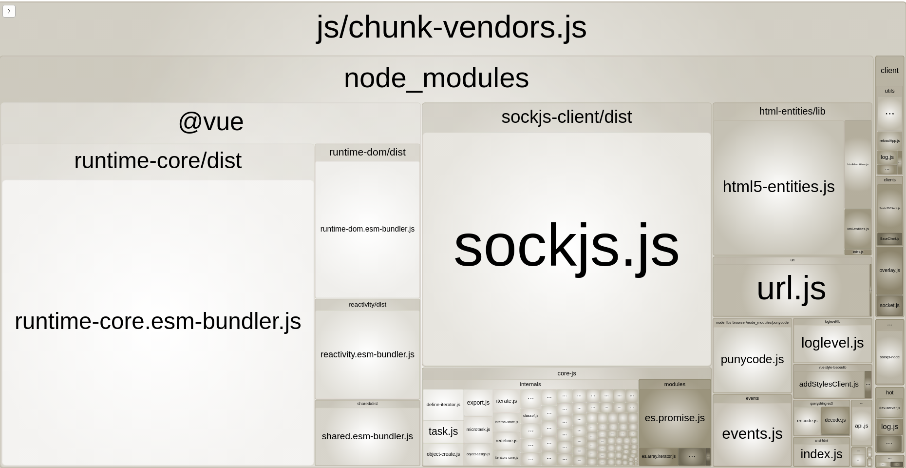
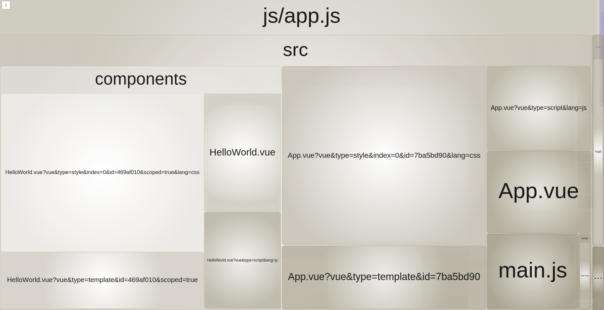

# {{ $page.title }}

<div class="text-xs text-gray-600"><time>{{ $page.frontmatter.publishDate }}</time></div>

In rebuilding my old Nuxt.js personal site, I wanted to challenge myself to learn the latest tech, the unknown.

The unknown was the new project by Evan You: [⚡ Vite](https://github.com/vitejs/vite) (/veet/). Called Fast, for the 🇫🇷 Frenchies.

I'll be comparing how Vite works to the standard [webpack](https://github.com/webpack/webpack) config using [webpack-dev-server](https://github.com/webpack/webpack-dev-server), which all major Vue frameworks
are using.

We'll first understand how webpack works, how Vite works and finally the best way to get started with Vite. 

Vite could the next best thing in tooling, currently, it's still in a pre-release stage though so be careful out there 🐛.

**Table of contents**

[[toc]]

## A Recap on Vite

Vite is a framework-agnostic web dev build tool. It's an experimental new direction in how build tools can work with a greenfield ecosystem. 

Vite's core functionality is similar to webpack + webpack-dev-server with some core improvements
on developer experience:
 
- ⌛ Less time waiting for your app to start, regardless of app size
- 🔥 Hot module reloading (HMR) that is basically instant, regardless of app size
- 🔨 On-demand compilation
- 🙅‍♂️ Zero configuration for numerous pre-processors out of the box
- 📜 Esbuild powered typescript / jsx (super quick)

### Speed Example
<figure>

|   | Build Time        | Dev Server Start Time  | Page Load Time  |
| ------------- |-------------:| -----:| -----:|
| Vue CLI     | <span class="text-red-400">5.14s</span> | <span class="text-red-400">2568ms</span> | <span class="text-yellow-400">320ms</span> | 
| Vite     | <span class="text-green-500">2.39s</span> | <span class="text-green-500">232ms</span>️ | <span class="text-yellow-500">379ms</span> |

<figcaption>New Vue 3 project / 10 components / no Babel / 2nd run, in development.</figcaption>
</figure>

## Vite vs Webpack

The main difference you'll notice with Vite and your webpack app, is how code is served in development and which modules are supported. 

**Webpack (Nuxt.js / Vue-CLI / etc):** 
- Supported Modules: [ES Modules](https://www.2ality.com/2014/09/es6-modules-final.html), [CommonJS](http://wiki.commonjs.org/) and [AMD Modules](https://github.com/amdjs/amdjs-api/wiki/AMD) 
- Dev Server: Bundled modules served via webpack-dev-server using express.js web server
- Production Build: Webpack

**Vite:**
- Supported Modules: [ES Modules](https://www.2ality.com/2014/09/es6-modules-final.html)
- Dev Server: Native-ES-Modules, served via Vite using a koa web server
- Production build: [Rollup](https://github.com/rollup/rollup)

Don't worry if the above terms don't make sense to you, we'll be exploring these concepts below.
    
::: tip TIP
Check out Mozilla's <a href="https://hacks.mozilla.org/2018/03/es-modules-a-cartoon-deep-dive/" target="_blank">article</a> on ES Modules if their new to you.
:::

## Understanding Webpack

To understand how Vite works, it's best to look at how Webpack works first. Even with its popularly, understanding Webpack can be intimidating, so I'll try to keep it simple.

Webpack is versatile in what you can do with it, but at it's core, it will:
- Start with an entry file, build a graph of your dependency tree: all the imports, exports from your code/files (modules)
- Transform / compile modules: think transpiling js for older browsers, turning SCSS into CSS
- Use algorithms to sort, rewrite and concatenate code
- Optimise

### Webpack In Development

Assuming you're using one of the main Vue frameworks, when you start your app in development, it is going to do a few things:
1. Bundle all of your code as per the above list
2. Start the webpack-dev-server which will serve the bundles
3. Handle Hot Module Reloading using sockets

As you may notice with your own apps, the bigger they grow, the longer you have to wait to start coding.

<figure>
  
  <figcaption>The Nuxt logo is almost burnt into my monitor at this point.</figcaption>
</figure>

Bundling in development is quicker because you don't need to do as much with the code, however, it can
still become painfully slow, especially on older machines. 

### Component Request Example

I created a default Vue 3 [Vue CLI](https://cli.vuejs.org/) project, which has an entry `App.vue` file using the `HelloWorld.vue` component. 
Let's see how this component gets to my browser.

HelloWorld.vue component:

```vue
<template>
  <div class="hello">
    <h1>{{ msg }}</h1>
  </div>
</template>

<script>
export default {
  props: {
    msg: String
  }
}
</script>

<style scoped>
h1 {
  color: green;
}
</style>
```

When I start my app and visit localhost I get the following HTML document back.

```html
<!DOCTYPE html>
<html lang="en">
  <head>
    <meta charset="utf-8">
    <meta http-equiv="X-UA-Compatible" content="IE=edge">
    <meta name="viewport" content="width=device-width,initial-scale=1.0">
  </head>
  <body>
    <div id="app"></div>
    <script type="text/javascript" src="/js/chunk-vendors.js"></script>
    <script type="text/javascript" src="/js/app.js"></script>
  </body>
</html>
```

You'll notice we have 2 script files there. On inspecting them you'd see a lot of gibberish looking code,
 it helps to use the [webpack-bundle-analyzer](https://www.npmjs.com/package/webpack-bundle-analyzer) to see how it works visually.

**chunk-vendors.js** 

These are third-party modules, usually coming from node_modules. The two main libraries in here are Vue itself and sockjs which is used for HMR.

<figure>
  
  <figcaption>chunk-vendors.js</figcaption>
</figure>

**app.js**

 This is all the code for my application. It contains components, assets, etc. You'll notice that for a SFC it splits
 it into multiple modules.

<figure>
  
  <figcaption>app-vendors.js</figcaption>
</figure>

Taking a quick look at the app.js file, we can find our HelloWorld component code within it. Some really beautiful code.

```js
/***/ "./src/components/HelloWorld.vue":
/*!***************************************!*\
  !*** ./src/components/HelloWorld.vue ***!
  \***************************************/
/*! exports provided: default */
/***/ (function(module, __webpack_exports__, __webpack_require__) {

"use strict";
eval("__webpack_require__.r(__webpack_exports__);\n/* harmony import */ var _HelloWorld_vue_vue_type_template_id_469af010_scoped_true__WEBPACK_IMPORTED_MODULE_0__ = __webpack_require__(/*! ./HelloWorld.vue?vue&type=template&id=469af010&scoped=true */ \"./src/components/HelloWorld.vue?vue&type=template&id=469af010&scoped=true\");\n/* harmony import */ var _HelloWorld_vue_vue_type_script_lang_js__WEBPACK_IMPORTED_MODULE_1__ = __webpack_require__(/*! ./HelloWorld.vue?vue&type=script&lang=js */ \"./src/components/HelloWorld.vue?vue&type=script&lang=js\");\n/* empty/unused harmony star reexport *//* harmony import */ var _HelloWorld_vue_vue_type_style_index_0_id_469af010_scoped_true_lang_css__WEBPACK_IMPORTED_MODULE_2__ = __webpack_require__(/*! ./HelloWorld.vue?vue&type=style&index=0&id=469af010&scoped=true&lang=css */ \"./src/components/HelloWorld.vue?vue&type=style&index=0&id=469af010&scoped=true&lang=css\");\n\n\n\n\n\n_HelloWorld_vue_vue_type_script_lang_js__WEBPACK_IMPORTED_MODULE_1__[\"default\"].render = _HelloWorld_vue_vue_type_template_id_469af010_scoped_true__WEBPACK_IMPORTED_MODULE_0__[\"render\"]\n_HelloWorld_vue_vue_type_script_lang_js__WEBPACK_IMPORTED_MODULE_1__[\"default\"].__scopeId = \"data-v-469af010\"\n/* hot reload */\nif (true) {\n  _HelloWorld_vue_vue_type_script_lang_js__WEBPACK_IMPORTED_MODULE_1__[\"default\"].__hmrId = \"469af010\"\n  const api = __VUE_HMR_RUNTIME__\n  module.hot.accept()\n  if (!api.createRecord('469af010', _HelloWorld_vue_vue_type_script_lang_js__WEBPACK_IMPORTED_MODULE_1__[\"default\"])) {\n    api.reload('469af010', _HelloWorld_vue_vue_type_script_lang_js__WEBPACK_IMPORTED_MODULE_1__[\"default\"])\n  }\n  \n  module.hot.accept(/*! ./HelloWorld.vue?vue&type=template&id=469af010&scoped=true */ \"./src/components/HelloWorld.vue?vue&type=template&id=469af010&scoped=true\", function(__WEBPACK_OUTDATED_DEPENDENCIES__) { /* harmony import */ _HelloWorld_vue_vue_type_template_id_469af010_scoped_true__WEBPACK_IMPORTED_MODULE_0__ = __webpack_require__(/*! ./HelloWorld.vue?vue&type=template&id=469af010&scoped=true */ \"./src/components/HelloWorld.vue?vue&type=template&id=469af010&scoped=true\");\n(() => {\n    api.rerender('469af010', _HelloWorld_vue_vue_type_template_id_469af010_scoped_true__WEBPACK_IMPORTED_MODULE_0__[\"render\"])\n  })(__WEBPACK_OUTDATED_DEPENDENCIES__); }.bind(this))\n\n}\n\n_HelloWorld_vue_vue_type_script_lang_js__WEBPACK_IMPORTED_MODULE_1__[\"default\"].__file = \"src/components/HelloWorld.vue\"\n\n/* harmony default export */ __webpack_exports__[\"default\"] = (_HelloWorld_vue_vue_type_script_lang_js__WEBPACK_IMPORTED_MODULE_1__[\"default\"]);//# sourceURL=[module]\n//# sourceMappingURL=data:application/json;charset=utf-8;base64,eyJ2ZXJzaW9uIjozLCJmaWxlIjoiLi9zcmMvY29tcG9uZW50cy9IZWxsb1dvcmxkLnZ1ZS5qcyIsInNvdXJjZXMiOlsid2VicGFjazovLy8uL3NyYy9jb21wb25lbnRzL0hlbGxvV29ybGQudnVlPzc3NmEiXSwic291cmNlc0NvbnRlbnQiOlsiaW1wb3J0IHsgcmVuZGVyIH0gZnJvbSBcIi4vSGVsbG9Xb3JsZC52dWU/dnVlJnR5cGU9dGVtcGxhdGUmaWQ9NDY5YWYwMTAmc2NvcGVkPXRydWVcIlxuaW1wb3J0IHNjcmlwdCBmcm9tIFwiLi9IZWxsb1dvcmxkLnZ1ZT92dWUmdHlwZT1zY3JpcHQmbGFuZz1qc1wiXG5leHBvcnQgKiBmcm9tIFwiLi9IZWxsb1dvcmxkLnZ1ZT92dWUmdHlwZT1zY3JpcHQmbGFuZz1qc1wiXG5cbmltcG9ydCBcIi4vSGVsbG9Xb3JsZC52dWU/dnVlJnR5cGU9c3R5bGUmaW5kZXg9MCZpZD00NjlhZjAxMCZzY29wZWQ9dHJ1ZSZsYW5nPWNzc1wiXG5zY3JpcHQucmVuZGVyID0gcmVuZGVyXG5zY3JpcHQuX19zY29wZUlkID0gXCJkYXRhLXYtNDY5YWYwMTBcIlxuLyogaG90IHJlbG9hZCAqL1xuaWYgKG1vZHVsZS5ob3QpIHtcbiAgc2NyaXB0Ll9faG1ySWQgPSBcIjQ2OWFmMDEwXCJcbiAgY29uc3QgYXBpID0gX19WVUVfSE1SX1JVTlRJTUVfX1xuICBtb2R1bGUuaG90LmFjY2VwdCgpXG4gIGlmICghYXBpLmNyZWF0ZVJlY29yZCgnNDY5YWYwMTAnLCBzY3JpcHQpKSB7XG4gICAgYXBpLnJlbG9hZCgnNDY5YWYwMTAnLCBzY3JpcHQpXG4gIH1cbiAgXG4gIG1vZHVsZS5ob3QuYWNjZXB0KFwiLi9IZWxsb1dvcmxkLnZ1ZT92dWUmdHlwZT10ZW1wbGF0ZSZpZD00NjlhZjAxMCZzY29wZWQ9dHJ1ZVwiLCAoKSA9PiB7XG4gICAgYXBpLnJlcmVuZGVyKCc0NjlhZjAxMCcsIHJlbmRlcilcbiAgfSlcblxufVxuXG5zY3JpcHQuX19maWxlID0gXCJzcmMvY29tcG9uZW50cy9IZWxsb1dvcmxkLnZ1ZVwiXG5cbmV4cG9ydCBkZWZhdWx0IHNjcmlwdCJdLCJtYXBwaW5ncyI6IkFBQUE7QUFBQTtBQUFBO0FBQUE7QUFBQTtBQUNBO0FBQ0E7QUFDQTtBQUNBO0FBQ0E7QUFDQTtBQUNBO0FBQ0E7QUFDQTtBQUNBO0FBQ0E7QUFDQTtBQUNBO0FBQ0E7QUFDQTtBQUNBO0FBQUE7QUFDQTtBQUNBO0FBQ0E7QUFDQTtBQUNBO0FBQ0E7QUFDQTtBQUNBIiwic291cmNlUm9vdCI6IiJ9\n//# sourceURL=webpack-internal:///./src/components/HelloWorld.vue\n");
```

Webpack does let you chunk the bundles how you like, for Nuxt.js it chunks routes individually. But you may see the problem here,
we have multiple monolith files that need to be generated anytime we want to use our app.

## Understanding Vite

Vite, at its core, doesn't set out to be a new code bundler like webpack or Rollup. Rather, a specific tool built for the developer experience.


### Vite In Development

When you start Vite for the first time pre-optimisations will be done on your node_modules, then [Koa](https://github.com/koajs/koa), a light-weight node web server starts. 
There is no bundling or compiling needed to start the dev server, so it's damn quick.

When you open your Vite app, the browser is going look at your entry file as a native es module, meaning it will read the `export` and `import` statements from your code.
It will transfer those lines into HTTP requests back to the server, where it will keep going your dependencies in a process until everything has been resolved.

```html
<script type="module">import "/vite/client"</script>
<div id="app"></div>
<script type="module" src="/@app/index.js"></script>
```

<figure>
  
  <figcaption>Network requests triggered from the entry.</figcaption>
</figure>

Vite makes the assumption that developers are going to be using the latest browser versions, so it can safely rely on the
 latest JS functionality straight from the browser - in other words, no babel transpiling!
 
 
### Component Request Example

Let's take a look at how these requests are working in the browser. Vite has sent me the following index.js file:

```js{5}
import '/@theme/styles/main.scss?import';
import Layout from '/@theme/Layout.vue';
import NotFound from '/@theme/NotFound.vue';
import CardPost from '/@theme/components/CardPost.vue';

const theme = {
    Layout,
    NotFound,
    enhanceApp({ app, }) {
        app.component('CardPost', CardPost)
    }
};
export default theme;
```

Normally, in webpack, you would have to transpile this code to something legacy browsers can understand. But new browsers know 
what to do with it. 

Let's drill into that highlighted line which is requesting the CardPost SFC. The browser will turn that import into a request for `http://localhost:3000/@theme/components/CardPost.vue`.

This is the CardPost.vue component in my code.

```vue
<template>
<div class="card-post">
  ...
</div>
</template>

<script>
import posts from '../../posts'

export default {
  props: {
    postIndex: {
      type: Number,
      required: true,
    }
  },
  computed: {
    post () {
      return posts[this.postIndex]
    }
  }
}
</script>

<style lang="scss" scoped>
.card-post {
  ...
}
</style>
```

Once the web server gets this request, it will need to compile the `CardPost,vue` file to javascript and send it back. Vite has many
optimisations around the Vue compiling so this takes no time.
 
 Let's look at what comes through:

```js{22-23}
import posts from '/.vitepress/posts.ts'

const __script = {
    props: {
        postIndex: {
            type: Number,
            required: true,
        }
    },
    computed: {
        post() {
            return posts[this.postIndex]
        }
    }
}

import "/@theme/components/CardPost.vue?type=style&index=0"
__script.__scopeId = "data-v-287b4794"
import {render as __render} from "/@theme/components/CardPost.vue?type=template"
__script.render = __render
__script.__hmrId = "/@theme/components/CardPost.vue"
typeof __VUE_HMR_RUNTIME__ !== 'undefined' && __VUE_HMR_RUNTIME__.createRecord(__script.__hmrId, __script)
__script.__file = "/home/harlan/sites/new.harlanzw.com/app/.vitepress/theme/components/CardPost.vue"
export default __script
//# sourceMappingURL=data:application/json;base64,eyJ2ZXJzaW9uIjozLCJzb3VyY2VzIjpbIi9ob21lL2hhcmxhbi9zaXRlcy9uZXcuaGFybGFuencuY29tL2FwcC8udml0ZXByZXNzL3RoZW1lL2NvbXBvbmVudHMvQ2FyZFBvc3QudnVlIl0sIm5hbWVzIjpbXSwibWFwcGluZ3MiOiI7QUFpQkEsQ0FBQyxDQUFDLENBQUMsQ0FBQyxDQUFDLEVBQUUsQ0FBQyxDQUFDLENBQUMsQ0FBQyxFQUFFLENBQUMsQ0FBQyxDQUFDLEVBQUUsQ0FBQyxDQUFDLENBQUMsQ0FBQyxDQUFDLENBQUMsQ0FBQyxDQUFDLENBQUMsQ0FBQyxDQUFDLENBQUM7O0FBRTlCLENBQUMsQ0FBQyxDQUFDLENBQUMsQ0FBQyxFQUFFLENBQUMsQ0FBQyxDQUFDLENBQUMsQ0FBQyxDQUFDLEVBQUU7RUFDYixDQUFDLENBQUMsQ0FBQyxDQUFDLENBQUMsRUFBRTtJQUNMLENBQUMsQ0FBQyxDQUFDLENBQUMsQ0FBQyxDQUFDLENBQUMsQ0FBQyxDQUFDLEVBQUU7TUFDVCxDQUFDLENBQUMsQ0FBQyxDQUFDLEVBQUUsQ0FBQyxDQUFDLENBQUMsQ0FBQyxDQUFDLENBQUM7TUFDWixDQUFDLENBQUMsQ0FBQyxDQUFDLENBQUMsQ0FBQyxDQUFDLENBQUMsRUFBRSxDQUFDLENBQUMsQ0FBQyxDQUFDO0lBQ2hCO0VBQ0YsQ0FBQztFQUNELENBQUMsQ0FBQyxDQUFDLENBQUMsQ0FBQyxDQUFDLENBQUMsQ0FBQyxFQUFFO0lBQ1IsQ0FBQyxDQUFDLENBQUMsRUFBRSxDQUFDLEVBQUU7TUFDTixDQUFDLENBQUMsQ0FBQyxDQUFDLENBQUMsRUFBRSxDQUFDLENBQUMsQ0FBQyxDQUFDLENBQUMsQ0FBQyxDQUFDLENBQUMsQ0FBQyxDQUFDLENBQUMsQ0FBQyxDQUFDLENBQUMsQ0FBQyxDQUFDLENBQUMsQ0FBQyxDQUFDLENBQUM7SUFDN0I7RUFDRjtBQUNGIiwiZmlsZSI6Ii9ob21lL2hhcmxhbi9zaXRlcy9uZXcuaGFybGFuencuY29tL2FwcC8udml0ZXByZXNzL3RoZW1lL2NvbXBvbmVudHMvQ2FyZFBvc3QudnVlIiwic291cmNlUm9vdCI6IiIsInNvdXJjZXNDb250ZW50IjpbIjx0ZW1wbGF0ZT5cbjxkaXYgY2xhc3M9XCJjYXJkLXBvc3QgLW14LTggbXktOCBob3ZlcjpzaGFkb3ctbGcgdHJhbnNpdGlvbi1hbGxcIj5cbiAgPGRpdiBjbGFzcz1cImNhcmQtcG9zdF9fZWZmZWN0XCI+PC9kaXY+XG4gIDxhIGNsYXNzPVwiY2FyZC1wb3N0X19saW5rIHVuc3R5bGVkXCIgOmhyZWY9XCJwb3N0LnVybFwiPjwvYT5cbiAgPGRpdiBjbGFzcz1cImNhcmQtcG9zdF9fY29udGVudFwiPlxuICAgICAgPGRpdiBjbGFzcz1cInAtOCBwcm9zZSBwcm9zZS14bFwiPlxuICAgICAgICA8aDMgc3R5bGU9XCJtYXJnaW4tdG9wOiAwICFpbXBvcnRhbnQ7XCI+PGEgOmhyZWY9XCJwb3N0LnVybFwiIGNsYXNzPVwidGV4dC0yeGxcIiBzdHlsZT1cImZvbnQtd2VpZ2h0OiBib2xkO1wiPnt7IHBvc3QudGl0bGUgfX08L2E+PC9oMz5cblxuICAgICAgICA8ZGl2IGNsYXNzPVwidGV4dC14cyB0ZXh0LWdyYXktNjAwXCI+PHRpbWU+e3sgcG9zdC5wdWJsaXNoZWQgfX08L3RpbWU+PC9kaXY+XG5cbiAgICAgICAgPHAgY2xhc3M9XCJ0ZXh0LW1kIHRleHQtZ3JheS02MDBcIj57eyBwb3N0LmV4Y2VycHQgfX08L3A+XG4gICAgICA8L2Rpdj5cbiAgPC9kaXY+XG48L2Rpdj5cbjwvdGVtcGxhdGU+XG5cbjxzY3JpcHQ+XG5pbXBvcnQgcG9zdHMgZnJvbSAnLi4vLi4vcG9zdHMnXG5cbmV4cG9ydCBkZWZhdWx0IHtcbiAgcHJvcHM6IHtcbiAgICBwb3N0SW5kZXg6IHtcbiAgICAgIHR5cGU6IE51bWJlcixcbiAgICAgIHJlcXVpcmVkOiB0cnVlLFxuICAgIH1cbiAgfSxcbiAgY29tcHV0ZWQ6IHtcbiAgICBwb3N0ICgpIHtcbiAgICAgIHJldHVybiBwb3N0c1t0aGlzLnBvc3RJbmRleF1cbiAgICB9XG4gIH1cbn1cbjwvc2NyaXB0PlxuXG48c3R5bGUgbGFuZz1cInNjc3NcIiBzY29wZWQ+XG4uY2FyZC1wb3N0IHtcblxuICBwb3NpdGlvbjogcmVsYXRpdmU7XG5cbiAgLnByb3NlIHtcbiAgICBtYXgtd2lkdGg6IDEwMCUgIWltcG9ydGFudDtcbiAgfVxuXG4gICZfX2xpbmsge1xuICAgIHBvc2l0aW9uOiBhYnNvbHV0ZTtcbiAgICBsZWZ0OiAwO1xuICAgIHRvcDogMDtcbiAgICB3aWR0aDogMTAwJTtcbiAgICBoZWlnaHQ6IDEwMCU7XG4gICAgY29udGVudDogJyAnO1xuICAgIHotaW5kZXg6IDE7XG4gIH1cblxuICAmX19jb250ZW50IHtcbiAgICBiYWNrZ3JvdW5kLWNvbG9yOiB3aGl0ZTtcbiAgICB6LWluZGV4OiAxO1xuICB9XG5cbiAgJl9fZWZmZWN0IHtcbiAgICB6LWluZGV4OiAtMTtcbiAgICBjb250ZW50OiAnICc7XG4gICAgaGVpZ2h0OiAzMHB4O1xuICAgIHdpZHRoOiAxMDAlO1xuICAgIHBvc2l0aW9uOiBhYnNvbHV0ZTtcbiAgICBiYWNrZ3JvdW5kLWNvbG9yOiByZ2IoNSwgMTUwLCAxMDUpO1xuICAgIHRyYW5zaXRpb246IDAuMnM7XG4gICAgb3BhY2l0eTogMDtcbiAgICB0b3A6IDMwcHg7XG4gIH1cblxuICAmOmhvdmVyIHtcbiAgICAuY2FyZC1wb3N0X19lZmZlY3Qge1xuICAgICAgdG9wOiAtNXB4O1xuICAgICAgb3BhY2l0eTogMTtcbiAgICAgIHRyYW5zZm9ybTogcm90YXRlKDAuMjVkZWcpO1xuICAgIH1cbiAgfVxufVxuPC9zdHlsZT5cbiJdfQ==
```

Cool, so quite a bit going on here. Interestingly, it's importing the `posts.ts,` template and styles from my component. It hasn't
attempted to bundle these imports into the main component.

If you're curious, this is what the style component response looks like, it's pretty nifty.

```js
import {updateStyle} from "/vite/client"
const css = ".card-post[data-v-287b4794] {\n  position: relative;\n}\n.card-post .prose[data-v-287b4794] {\n  max-width: 100% !important;\n}\n.card-post__link[data-v-287b4794] {\n  position: absolute;\n  left: 0;\n  top: 0;\n  width: 100%;\n  height: 100%;\n  content: \" \";\n  z-index: 1;\n}\n.card-post__content[data-v-287b4794] {\n  background-color: white;\n  z-index: 1;\n}\n.card-post__effect[data-v-287b4794] {\n  z-index: -1;\n  content: \" \";\n  height: 30px;\n  width: 100%;\n  position: absolute;\n  background-color: #059669;\n  transition: 0.2s;\n  opacity: 0;\n  top: 30px;\n}\n.card-post:hover .card-post__effect[data-v-287b4794] {\n  top: -5px;\n  opacity: 1;\n  transform: rotate(0.25deg);\n}"
updateStyle("287b4794-0", css)
export default css
```

In one small component we can see that it's making 4 subsequent HTTP request, assuming our the child requests don't have their own modules to import.

This is where Vite slows down, imagine hundreds of HTTP requests which rely on other HTTP requests. Fortunately, 
there are optimisation to avoid this situation after the first load. The server will response with a 304 Unmodified HTTP response for modules which haven't
 changed, meaning they used the cache version, loading instantly. 
 
It also only loads files that are needed to show on the route you've visited, allowing it to scale to any app size.

## Summary

While I haven't touched on a lot of the complexities of Vite and Webpack, I've tried to show you the main difference, how 
bundling and no-bundling look in action. 

Hopefully you've seen why Vite does is really promising. There is so much potential in the ecosystem at the moment, watch this space, given 12-months we could see an explosion of Vite related projects.

If you want to find out more about Vite, I'd watch Evan's talk on Vite & VitePress here:  

<iframe width="560" height="315" src="https://www.youtube.com/embed/xXrhg26VCSc" frameborder="0" allow="accelerometer; autoplay; clipboard-write; encrypted-media; gyroscope; picture-in-picture" allowfullscreen></iframe>


## Getting started with Vite

I'd recommend just spinning up bare-bones Vite to get a feel for it. It's really easy, takes less than a minute.

```shell script
npm init vite-app
```

Once you are sold, it's worth checking out [the ecosystem](https://github.com/vitejs/awesome-vite) before you build.  

### Recommendations

::: warning TIP
You shouldn't be looking to replace Vue-CLI or Webpack with Vite for existing projects yet, but it may be worthwhile to check out for new smaller scoped projects.
:::

The Vite ecosystem isn't that mature yet, the two main projects I'd recommend checking out are [VitePress](https://vitepress.vuejs.org/) and [Vitesse](https://github.com/antfu/vitesse). 

If you are need of a documentation site then VitePress is really awesome, otherwise, I'd choose Vitesse as it's going to give you more flexible
on customising your app.

If you like my blog (VitePress + tailwindcss), then you're more than welcome to clone it.


## Final Thoughts

A week ago I had zero knowledge of Vite, no knowledge about bundling, dev servers and modules. It has been a long, 
rewarding week of learning. I wrote this article to cement my own learning and have some content for my new site. I'd love any and all feedback you have.

Thanks for reading.